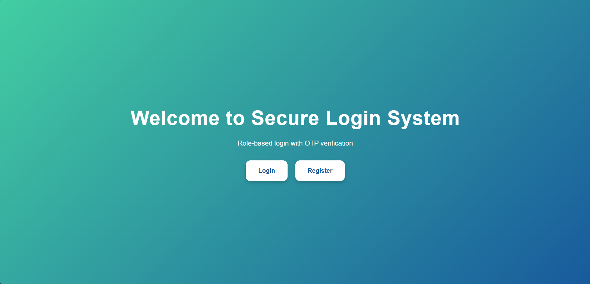
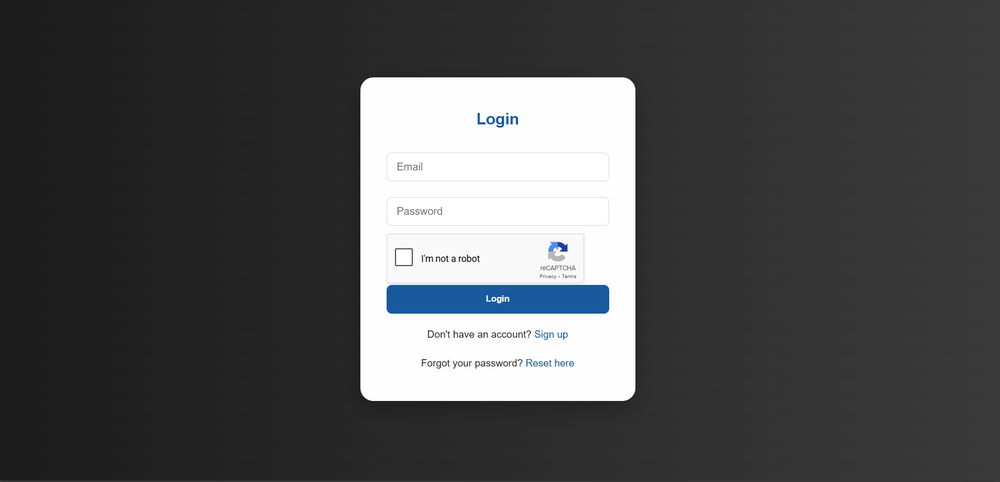
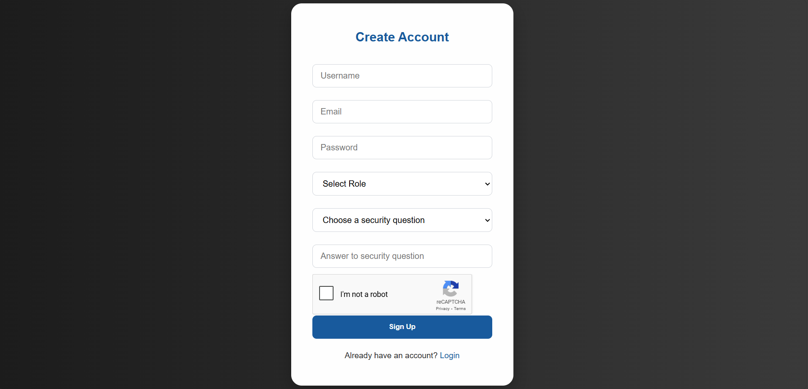
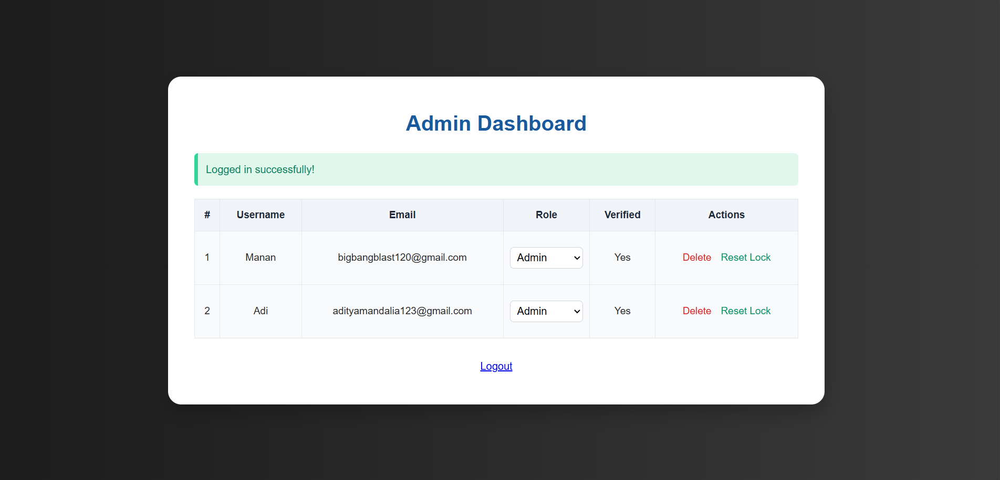
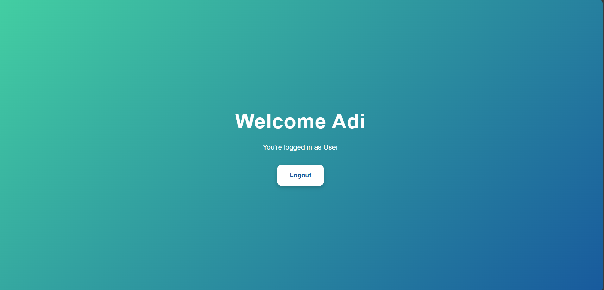
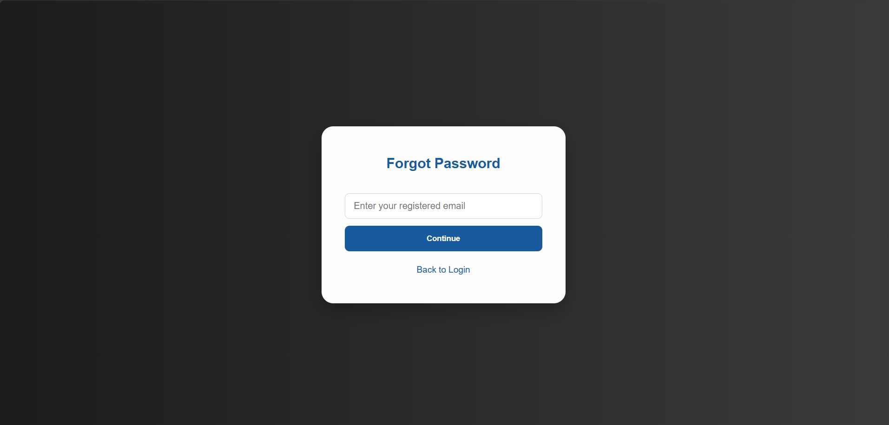
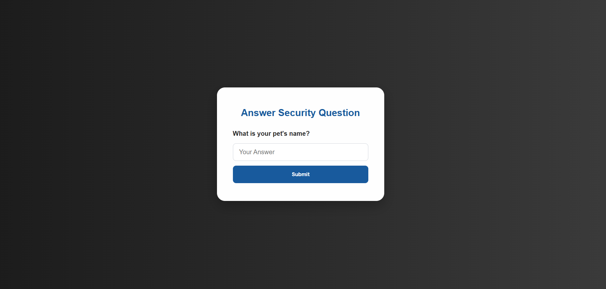
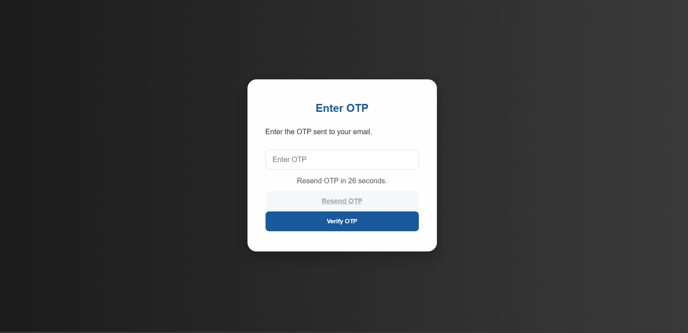
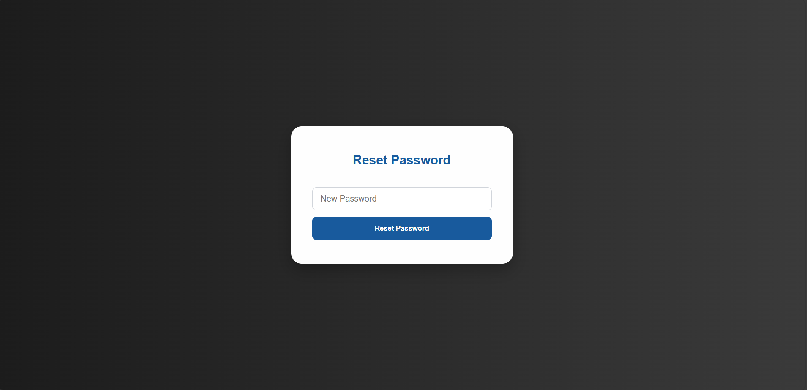

# Secure Login System with User Role Management 🛡️

## 📌 Objective
To develop a secure web-based login system that implements user **authentication**, **authorization**, and **role-based access control (RBAC)** using Python (Flask) and MongoDB. This project demonstrates essential cybersecurity principles including password hashing, session management, CAPTCHA protection, and access control.

---

## 📂 Table of Contents

1. [Project Setup](#1-project-setup)
2. [Frontend Overview](#2-frontend-overview)
3. [Backend Structure](#3-backend-structure)
4. [Core Features](#4-core-features)
5. [Security Enhancements](#5-security-enhancements)
6. [Screenshots](#6-screenshots)
7. [Installation and Usage](#7-installation-and-usage)
8. [Challenges & Solutions](#8-challenges--solutions)
9. [Final Submission](#9-final-submission)

---

## ✅ 1. Project Setup

- IDE: Visual Studio Code
- Backend: Flask (Python)
- Database: MongoDB
- Version Control: Git + GitHub

---

## 🎨 2. Frontend Overview

The frontend consists of multiple HTML pages with role-specific and secure workflow features.

### Pages Included

| Page Name               | Description                                                             |
|-------------------------|-------------------------------------------------------------------------|
| `index.html`            | Landing or welcome page                                                 |
| `login.html`            | Login form for users                                                    |
| `register.html`         | Registration page with role selection (Admin/User)                      |
| `admin_dashboard.html`  | Dashboard for Admin to view/manage users                                |
| `user_dashboard.html`   | Dashboard for regular Users                                             |
| `forgot_password.html`  | Form to initiate password recovery                                      |
| `security_question.html`| Step 2 in password recovery – verify user identity                      |
| `verify_otp.html`       | Enter OTP sent to registered email                                      |
| `reset_password.html`   | Set a new password after OTP verification                               |

---

## 🧠 3. Backend Structure

- **Framework:** Flask
- **Database:** MongoDB
- **Libraries Used:** `flask`, `flask_mail`, `pymongo`, `bcrypt`, `itsdangerous`, `requests`
- **Folder Structure:**
  ```
  project/
  ├── static/
  ├── templates/
  ├── screenshots/
  ├── app.py
  └── README.md
  ```

---

## 🔐 4. Core Features

- Secure Registration with password hashing (`bcrypt`)
- Role selection (Admin/User)
- Login with session-based authentication
- Role-Based Access Control (RBAC)
- Forgot Password with security question, OTP, and reset
- CAPTCHA protection
- Account lockout after failed attempts

---

## 🛡️ 5. Security Enhancements

- Input sanitization
- CAPTCHA (Google reCAPTCHA or custom)
- Lockout system after 3 failed logins
- Secure cookies & sessions

---

## ✅ Pages and Demonstrations

The following are the screenshots demonstrating core UI pages:

### 🏠 Index Page


---

### 🔐 Login Page


---

### 📝 Register Page


---

### 🛠️ Admin Dashboard


---

### 👤 User Dashboard


---

### 🔒 Forgot Password


---

### ❓ Security Question


---

### ✉️ OTP Verification


---

### 🔁 Reset Password


---

## ⚙️ 7. Installation and Usage

### Prerequisites

- Python 3.8+
- MongoDB
- Git

### Setup Instructions

```bash
# Clone the repository
git clone https://github.com/<your-username>/secure-login-system.git
cd secure-login-system

# Create virtual environment
python -m venv venv
source venv/bin/activate  # Windows: venv\Scripts\activate

# Install dependencies
pip install -r requirements.txt

# Run the app
python app.py
```

---

## 🚧 8. Challenges & Solutions

| Challenge                           | Solution                                |
|------------------------------------|-----------------------------------------|
| Secure password storage            | Used `bcrypt` hashing                   |
| Brute-force protection             | CAPTCHA and account lockout             |
| Role-based redirection             | Used Flask decorators and session       |
| Form validation                    | Frontend + backend checks               |

---

## 📝 9. Final Submission

- ✅ All core features implemented
- ✅ Pages added: login, register, dashboard, forgot/reset password
- ✅ Role-based navigation working
- ✅ Screenshots placed in `screenshots/` folder
- ✅ Code structured and documented

---

## 📎 GitHub Repository

> 🔗 [https://github.com/AdityaMandaliya75/secure-login-system](https://github.com/AdityaMandaliya75/secure-login-system)

---

## 📧 Contact

For queries, raise an issue or contact: **[adityamandalia123@example.com](mailto:adityamandalia123@example.com)**

---
